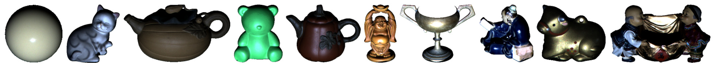
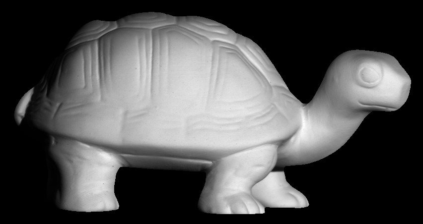

# UPS-GCNet

**[What is Learned in Deep Uncalibrated Photometric Stereo? (ECCV 2020)](http://guanyingc.github.io/UPS-GCNet/)**.
<br>
[Guanying Chen](https://guanyingc.github.io), [Michael Waechter](https://sites.google.com/view/mwaechter), [Boxin Shi](http://ci.idm.pku.edu.cn/), [Kwan-Yee K. Wong](http://i.cs.hku.hk/~kykwong/), [Yasuyuki Matsushita](http://www-infobiz.ist.osaka-u.ac.jp/en/member/matsushita/)
<br>

This paper targets at discovering what a deep uncalibrated photometric stereo (UPS) network learns to resolve the problem's inherent ambiguity, and introduce a guided cailbration network (GCNet) based on our analysis.

## Overview:
We provide:
- Code to test our method on [DiLiGenT dataset](https://sites.google.com/site/photometricstereodata/single), [Light Stage Data Gallery](https://vgl.ict.usc.edudata/LightStage/), [Gourd&Apple dataset](http://vision.ucsd.edu/~nalldrin/research/), [Harvard photometric stereo dataset](http://vision.seas.harvard.edu/qsfs/Data.html), and synthetic datasets.
- Full code to train a new model, including codes for debugging, visualization and logging.

## Table of Contents

* [Dependencies](#dependencies)
* [Testing](#testing)
  * [Download the trained models](#download-the-trained-models)
  * [Test GCNet on the DiLiGenT main dataset](#test-gcnet-on-the-diligent-main-dataset)
  * [Test GCNet on Light Stage Data Gallery](#test-gcnet-on-light-stage-data-gallery)
  * [Test GCNet on Gourd&amp;Apple dataset](#test-gcnet-on-gourdapple-dataset)
  * [Test GCNet on Harvard photometric stereo dataset](#test-gcnet-on-harvard-photometric-stereo-dataset)
  * [Test GCNet on synthetic data](#test-gcnet-on-synthetic-data)
  * [Test LCNet on the above datasets](#test-lcnet-on-the-above-datasets)
* [Code Structure](#code-structure)
* [Training](#training)
* [Acknowledgement](#acknowledgement)
* [Citation](#citation)


## Dependencies
GCNet is implemented in [PyTorch](https://pytorch.org/) and tested with Ubuntu (14.04 and 16.04) and Centos 7. 
- Python 3.7 
- PyTorch 1.10 and torchvision 0.30

You are highly recommended to use Anaconda and create a new environment to run this code. The following is an example procedure to install the dependencies.
```shell
# Create a new python3.7 environment named ups-py37
conda create -n ups-py37 python=3.7

# Activate the created environment
source activate ups-py37

pip install -r requirements.txt

# Download this code
git clone https://github.com/guanyingc/UPS-GCNet.git
cd UPS-GCNet
```

## Testing
#### Download the trained models
```shell
bash scripts/download_pretrained_models.sh
# Pretrained models can be found in data/models_ECCV2020/
```

The trained models can also be downloaded in Google Drive ([models_release/](https://drive.google.com/drive/folders/19_GYdF2_kPUqmGxdRDkRCT7smokjiE3Z?usp=sharing)).

#### Test GCNet on the DiLiGenT main dataset
<p align="center">
    
</p>

This dataset can be downloaded in [https://sites.google.com/site/photometricstereodata/single](https://sites.google.com/site/photometricstereodata/single). 

```shell
# Prepare the DiLiGenT main dataset
bash scripts/prepare_diligent_dataset.sh

# Estimate light directions and intensities using GCNet_model. --benchmark indicates the testing dataset, --bm_dir indicates the data directory.
python run_model.py --gpu_ids 0 --model GCNet_model --GCNet_name GCNet --GCNet_checkp data/models_ECCV2020/GCNet.pth \
    --benchmark ups_DiLiGenT_dataset --bm_dir data/datasets/DiLiGenT/pmsData_crop

# Estimate lightings and surface normals using GCNet_N_model. --Normal_Net_name indicates the name of the calibrated normal estimation network. 
# We use the pretrained PS-FCN for normal estimation
python run_model.py --gpu_ids 0 --model GCNet_N_model --GCNet_name GCNet --GCNet_checkp data/models_ECCV2020/GCNet.pth \ 
    --Normal_Net_name PS_FCN --Normal_Net_checkp data/models_ECCV2020/PS-FCN_B_S_32.pth \
    --benchmark ups_DiLiGenT_dataset --bm_dir data/datasets/DiLiGenT/pmsData_crop
# Results can be found in data/models_ECCV2020/
```

#### Test GCNet on Light Stage Data Gallery
<p align="center">
    
</p>

This dataset can be downloaded in [https://vgl.ict.usc.edudata/LightStage/](https://vgl.ict.usc.edudata/LightStage/). For easier testing, we have downloaded and converted this dataset to numpy arrays. As we used 133 images for each object, the dimension of numpy array for each object is `HxWx(133x3)`. 
The processed numpy array can be download in Google Drive ([LightStage_Numpy_Data.tgz](https://drive.google.com/drive/folders/19_GYdF2_kPUqmGxdRDkRCT7smokjiE3Z?usp=sharing)).
You can get access to individual image from the numpy array by the following code snippet.
```python
import numpy as np
img_array = np.load(array_name)
imgs = np.split(img_array, img_array.shape[2]//3, 2) # you will get a list of image of shape [H, W, 3]
```
Please download, unzip (e.g., `tar -zxvf LightStage_Numpy_Data.tgz`), and place this dataset in `data/datasets/`.
```shell
# Estimate light directions and intensities. Note that it requires sometime to load the data from hard disk.
python run_model.py --gpu_ids 0 --model GCNet_model --GCNet_name GCNet --GCNet_checkp data/models_ECCV2020/GCNet.pth \
    --benchmark ups_LightStage_dataset --bm_dir data/datasets/LightStage_Numpy_Data/

# You can also estimate the normals with PS-FCN using GCNet_N_model as follows. However, the following command requires more than 13 GB to run as the image size in this dataset is large.
python run_model.py --gpu_ids 0 --model GCNet_N_model --GCNet_name GCNet --GCNet_checkp data/models_ECCV2020/GCNet.pth --Normal_Net_name PS_FCN --Normal_Net_checkp data/models_ECCV2020/PS-FCN_B_S_32.pth \
    --benchmark ups_LightStage_dataset --bm_dir data/datasets/LightStage_Numpy_Data/
```

#### Test GCNet on Gourd&Apple dataset
<p align="center">
    
    
    
</p>

This dataset can be downloaded in [http://vision.ucsd.edu/~nalldrin/research/](http://vision.ucsd.edu/~nalldrin/research/). Similarly, we converted this dataset to numpy array for eaiser testing. The processed numpy array can be download in Google Drive ([Gourd_Apple_Numpy_Data.tgz](https://drive.google.com/drive/folders/19_GYdF2_kPUqmGxdRDkRCT7smokjiE3Z?usp=sharing)). 
The python script for data conversion can be found in [scripts/convert_gourd_apple_to_numpy.py](scripts/convert_gourd_apple_to_numpy.py).
Please download, unzip, and place this dataset in `data/datasets/`.

```shell
python run_model.py --gpu_ids 0 --model GCNet_model --GCNet_name GCNet --GCNet_checkp data/models_ECCV2020/GCNet.pth \
    --benchmark ups_GourdApple_dataset --bm_dir data/datasets/Gourd_Apple_Numpy_Data/
```

#### Test GCNet on Harvard photometric stereo dataset

<p align="center">
    
    
    
    
    
    
    
</p>

This dataset can be downloaded in [http://vision.seas.harvard.edu/qsfs/Data.html](http://vision.seas.harvard.edu/qsfs/Data.html).

```shell
bash scripts/prepare_harvard_dataset.sh # Prepare dataset

python run_model.py --gpu_ids 0 --model GCNet_model --GCNet_name GCNet --GCNet_checkp data/models_ECCV2020/GCNet.pth \
    --benchmark ups_Harvard_dataset --bm_dir data/datasets/Harvard/PSData
```

#### Test GCNet on synthetic data
We provide the rendered synthetic Dragon and Armadillo for testing. This dataset was rendered with 100 MERL BRDFs under 100 light directions using [mitsuba](https://www.mitsuba-renderer.org/). We saved the rendered synthetic dataset in 16 bit EXR file (we have also saved the 8 bit PNG images). Library `OpenEXR` is required to load the data. This dataste can be downloaded in Google Drive ([PS_Synth_MERL_Test_ECCV2020.tgz](https://drive.google.com/drive/folders/19_GYdF2_kPUqmGxdRDkRCT7smokjiE3Z?usp=sharing)).
```shell
sudo apt-get install libopenexr-dev # For Ubuntu
pip install OpenEXR 
```

Test GCNet on Dragon rendered under 82 light directions used in the paper.
```shell
python run_model.py --gpu_ids 0 --model GCNet_model --GCNet_name GCNet --GCNet_checkp data/models_ECCV2020/GCNet.pth \
    --benchmark ups_synth_test_dataset --bm_dir data/datasets/PS_Synth_MERL_Test_ECCV2020/ --syn_obj dragon --light_index light_82_idx.txt
```

Test GCNet on Armadillo rendered under different lighting distributions as in Table 5 of the paper.
```shell
python run_model.py --gpu_ids 0 --model GCNet_model --GCNet_name GCNet --GCNet_checkp data/models_ECCV2020/GCNet.pth \
    --benchmark ups_synth_test_dataset --bm_dir data/datasets/PS_Synth_MERL_Test_ECCV2020/ --syn_obj armadillo \
    --light_index light_uniform_idx.txt 
# --light_index can be set as light_narrow_idx.txt or light_up_idx.txt.
```

#### Test LCNet on the above datasets
The above testing commands can be adapted for testing LCNet as follows. Please specify `--benchmark` and `--bm_dir` to test on different datasets.
```shell
python run_model.py --gpu_ids 0 --model L_model --L_Net_name LCNet --L_Net_checkp data/models/LCNet_CVPR2019.pth.tar \
    --benchmark XXXXX --bm_dir XXXX
```

## Code Structure
- We use `models/xxx_model.py` (e.g., `L_model.py`, `GCNet_model.py`) to control the forward, backward, and visualization procedures. `xxx_model.py` will initialize specific network(s) for training and testing. Network architectures are placed in `models/archs/`.
```
├── main.py
├── run_model.py
├── datasets
│   ├── __init__.py
│   ├── pms_transforms.py
│   ├── ups_DiLiGenT_dataset.py
│   ├── ups_GourdApple_dataset.py
│   ├── ups_Harvard_dataset.py
│   ├── ups_LightStage_dataset.py
│   ├── ups_synth_dataset.py
│   ├── ups_synth_test_dataset.py
│   └── util.py
├── models
│   ├── archs
│   │   ├── GCNet.py
│   │   ├── LCNet.py
│   │   ├── L_Net.py
│   │   ├── N_Net.py
│   │   └── PS_FCN.py
│   ├── __init__.py
│   ├── model_utils.py
│   ├── base_model.py
│   ├── GCNet_model.py
│   ├── GCNet_N_model.py
│   ├── L_model.py
│   ├── L_N_model.py
│   └── N_model.py
├── options
│   ├── __init__.py
│   ├── base_opts.py
│   ├── run_model_opts.py
│   └── train_opts.py
└── utils
    ├── __init__.py
    ├── draw_utils.py
    ├── eval_utils.py
    ├── logger.py
    ├── recorders.py
    ├── test_utils.py
    ├── time_utils.py
    ├── train_utils.py
    └── utils.py
```

## Training
The training process is described in [docs/training.md](docs/training.md).

## Acknowledgement
Part of the code is based on the great [pytorch-CycleGAN-and-pix2pix](https://github.com/junyanz/pytorch-CycleGAN-and-pix2pix) repository.

## Citation
Please cite the corresponding paper(s) if you use the real dataset(s) in your work (e.g., DiLiGenT benchmark, Light Stage Data Gallery, Gourd&Apple Dataset, and Harvard Photmetric Stereo Dataset). 

If you find this code or the provided models useful in your research, please consider cite: 
```
@article{chen2020_gcnet,
  title={What is Learned in Deep Uncalibrated Photometric Stereo?},
  author={Chen, Guanying and Waechter Michael and Shi, Boxin and Wong, Kwan-Yee K. and Matsushita, Yasuyuki},
  journal={ECCV},
  year={2020},
}
```
