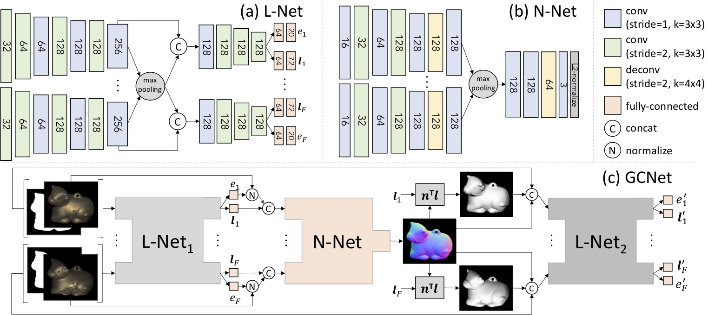

## Training Guided Calibration Network
<br>
<p align="center">
    
</p>

We adopted the publicly available synthetic [PS Blobby and Sculpture datasets](https://github.com/guanyingc/PS-FCN) for training.
To train a new GCNet model, please follow the following steps:

#### Download the training data
```shell
# The total size of the zipped synthetic datasets is 4.7+19=23.7 GB 
# and it takes some times to download and unzip the datasets.
bash scripts/download_synthetic_datasets.sh
```
If the above command is not working, please manually download the training datasets from Google Drive ([PS Sculpture Dataset and PS Blobby Dataset](https://drive.google.com/drive/folders/1VxrPsV8Pg28JCcMZklW1LcBFm4crhK0F?usp=sharing)) and put them in `./data/datasets/`.

```shell
# download trained intermediate models.
bash scripts/download_trained_intermediate_models.sh
```
The trained models can also be downloaded in Google Drive ([models_release/](https://drive.google.com/drive/folders/19_GYdF2_kPUqmGxdRDkRCT7smokjiE3Z?usp=sharing)).

#### Step 1: Train L-Net1 and N-Net independently
```shell
python main.py --model L_model --gpu_ids 0 --epochs 20
# Results and checkpoints can be found in logdir/ups_synth_dataset/*L_model*/. It takes around 20 hours. 
# Copy the checkpoint to data/trained_models/L-Net1.pth. You can found the provided trained model in data/intermediate_model/L-Net1.pth

python main.py --model N_model --gpu_ids 1 --epochs 30
# Results and checkpoints can be found in logdir/ups_synth_dataset/*_N_model*/. It takes around 5 Hours. 
# Copy the checkpoint to data/trained_models/N-Net_from_scratch.pth. You can found the provided trained model in data/intermediate_model/N-Net_from_scratch.pth
```

#### Step 2: Retrain N-Net given the lightings estimated by L-Net1
```shell
python main.py --model L_N_model --gpu_ids 0,1 \
    --L_Net_checkp data/trained_models/L-Net1.pth \
    --N_Net_checkp data/trained_models/N-Net_from_scratch.pth --epochs 5
# Results and checkpoints can be found in logdir/ups_synth_dataset/*_L_N_model*/. It takes around 5 hours using two GPUs.
# To trained wih a single GPU, you may need to use a smaller batch size (e.g., --batch 16).
# Copy the checkpoint to data/trained_models/N-Net.pth. You can found the provided trained model in data/intermediate_model/N-Net.pth
```

#### Step 3: Train L-Net2
```shell
python main.py --model GCNet_model --gpu_ids 0,1 \
    --L_Net1_checkp data/trained_models/L-Net1.pth \
    --N_Net_checkp data/trained_models/N-Net.pth --epochs 20
# Results and checkpoints can be found in logdir/ups_synth_dataset/*_GCNet_model*/. It takes around 15 hours using two GPUs. 
# Copy the checkpoint to data/trained_models/L1_N_L2-Net.pth. You can found the provided trained model in data/intermediate_model/L1_N_L2-Net.pth
```

#### Step 4: End-to-end fine-tuning
```shell
python main.py --model GCNet_model --gpu_ids 0,1 \
    --GCNet_checkp data/trained_models/L1_N_L2-Net.pth \
    --end2end_ft --est_sd --init_lr 0.0001 --epochs 20 
# Results and checkpoints can be found in logdir/ups_synth_dataset/*_GCNet_model*end2end_ft*/. It takes around 20 hours using two GPUs. 
```

## Training PS-FCN and LCNet
This repository also supports the training and testing of PS-FCN (ECCV 2018), LCNet (CVPR 2019).

#### Train PS-FCN
```shell
python main.py --model N_model --N_Net_name PS_FCN --gpu_ids 1 --epochs 30 --milestones 5 10 15 20 25
# Results and checkpoints can be found in logdir/ups_synth_dataset/*PS_FCN,N_model*/.
```

#### Train LCNet
```shell
python main.py --model L_model --L_Net_name LCNet --gpu_ids 0 --epochs 20 --milestones 5 10 15
# Results and checkpoints can be found in logdir/ups_synth_dataset/*LCNet,L_model*/.
```
